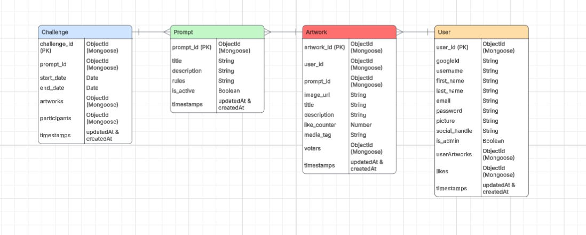

# ARTHIVE

ARTHIVE is a creative platform designed for artists of all levels who want inspiration and community. Each week, the app sends out a unique art challenge to spark creativity and encourage participation. Artists can upload their work, explore others’ submissions, and engage with the community through feedback and support. By combining structured challenges with a collaborative space, ARTHIVE helps artists stay motivated, improve their skills, and share their creativity with a wider audience.

#### Database Schema Diagram

## Prerequisites

Before running this project, please make sure your development environment has the following installed:
- Node.js : https://nodejs.org/en
- npm : https://docs.npmjs.com/downloading-and-installing-node-js-and-npm
- MongoDB : https://www.mongodb.com/try/download/community
- Git : https://git-scm.com/downloads

#### Google Console & Google Storage Set-Up
##### Google Console Set-Up
1. Developer Account
- Make sure you have a Google Developer account: https://developers.google.com/.
2. Google Cloud Console
- Go to Google Cloud Console.
- Create or select a project for your application.
3. Set Up OAuth Credentials
- Navigate to APIs & Services.
- Click on the Credentials tab and then on Create credentials.
- Select OAuth client ID. 
- For the Application type, choose Web application.
- Enter your application name.
- Add your authorized redirect URI (this must match exactly with your GOOGLE_CALLBACK_URL in your application).
4. Get Client ID and Secret
- Once created, Google will give you a GOOGLE_CLIENT_ID and GOOGLE_CLIENT_SECRET.
- These valus go into your environment variables (.env file).

##### Google Image Upload 
1. Google Cloud Console
- Go to Google Cloud Console.
- Navigate to Cloud Storage and then click on Buckets.
2. Google Cloud Storage and Buckets
- In Buckets, click on Create.
- Choose a permanent name for the Bucket.
- In the section to Choose where to store your data, select your region.
- In the section to Choose how to store your data, choose Standard.
- Leave, all of the other defaut settings as is, and click on Create.
 Note: If prompted too, please allow publlic access so that anyone with the image URL can see the image.
3. Create Service Account For Access
- In the left hand navigation, select IAM & Admin.
- From the left hand navigation, select Service Accounts.
- Click on Create Service Accounts.
- Give the service account a name, then click Create and Continue.
- In permissions, select Storage Admin and Storage Object Admin for the Roles.
- Set your access controls to your desired settings.
- Click Create.
4. Service Account For Image Upload
- Navigate to your service account and select Keys from the top menu.
- Click Add Key, choose Create new key, select JSON, and click Create. 
- The JSON key file will be generated and downloaded automatically to your computer.
5. Adding Service Account To Your Application
- Save the downloaded JSON file into your project.
    Example path: config/service-account.json
- Add config/service-account.json to your .gitignore to prevent it from being committed.
- Add the following environment variables to your .env file:
    GOOGLE_APPLICATION_CREDENTIALS_JSON=./config/service-account.json
    BUCKET_NAME=YourBucketName
    IMAGE_UPLOAD_BASE_URL=https://storage.googleapis.com

#### MONGO DB Connection

##### MONGO DB Atlas
To connect your project to the MongoDB Atlas Database, please follow these instructions:
1. Create or login to your MongoDB Atlas Account (https://www.mongodb.com/products/platform/atlas-database).
2. Once logged in, in the top left corner click on Project and select or add the project that you would like to work on.
3. Once you are in your desired project dashboard, click on the connect button and select drivers.
4. Select your connection driver and version and then copy the Mongo URL.

 Note: In the Mongo URL, these components will need to be replaced:
 - Replace <username> with the username of the database user you created.
 - Replace <password> with that user's password. Do not share this connection string publicly.

##### MONGO DB Compass
To connect your project to the MongoDB Compass Database please follow these instructions:
1. Download MongoDB Compass (https://www.mongodb.com/try/download/compass).
2. Choose the appropriate download package for your operating system.
3. Run the download installer and complete the installation.
4. Once the application has been successfully installed, open MOngoDB Compass on your computer.
5. Click on the (+) in the left hand side to add a new connection.
6. In the URI, replace the pre-determind link with your connection string from MongoDB Atlas. 
7. Click save and then click connect.


## Application Package Installation 

Please install these packages into your development environemnt:

```bash
npm install
```
    - cors
    - dotenv
    - express
    - express-favicon
    - express-session
    - mongodb
    - mongoose
    - morgan
    - passport
    - passport-google-oauth2
    - @google-cloud/storage
    - multer
    - jsonwebtoken
    - bcrypt

## Application Set-Up Instructions

To set up the project locally, follow these steps:

1. Clone the repository
```bash
https://github.com/Code-the-Dream-School/jj-practicum-team-4-back
```
2. Create a .env file

3. Add the following variables in the .env file
```bash
#Google Project Console
GOOGLE_CLIENT_ID=the_google_client_id_from_your_google_developer_console
GOOGLE_CLIENT_SECRET=the_google_client_secret_from_your_google_developer_console
GOOGLE_CALLBACK_URL=the_google_callback_url_from_your_google_developer_console

#Google Cloud Storage Console
GOOGLE_APPLICATION_CREDENTIALS_JSON=./config/service-account.json
BUCKET_NAME=your_bucket_name
IMAGE_UPLOAD_BASE_URL=https://storage.googleapis.com

#JWT
JWT_SECRET=your_JWT_secret
JWT_LIFETIME=your_JWT_lifetime

#Session 
SESSION_SECRET=your_session_secret

#Database
MONGO_URI=your_mongo_url

#Server
PORT=your_port_value
```
Please note, the GOOGLE_CLIENT_ID, GOOGLE_CLIENT_SECRET, BUCKET_NAME, and GOOGLE_CALLBACK_URL can be retrieved from the application google cloud hub.

4. Run the application
```bash
node src/server.js
```


