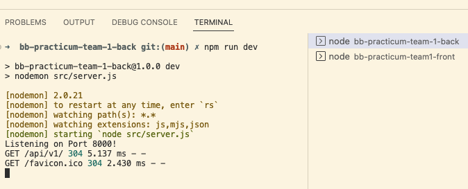

# ARTHIVE

ArtHive is a creative platform designed for artists of all levels who want inspiration and community. Each week, the app sends out a unique art challenge to spark creativity and encourage participation. Artists can upload their work, explore others’ submissions, and engage with the community through feedback and support. By combining structured challenges with a collaborative space, ArtHive helps artists stay motivated, improve their skills, and share their creativity with a wider audience.

### Draft 1: README.md

- Initial project description and core idea.
- Basic prerequisites, dependencies, and set-up.

## Prerequisites

Before running this project, please make sure your development environment has the following installed:
- Node.js : https://nodejs.org/en
- npm : https://docs.npmjs.com/downloading-and-installing-node-js-and-npm
- MongoDB : https://www.mongodb.com/try/download/community
- Git : https://git-scm.com/downloads

##### Google Console Set-Up
- Please make sure you have a developer account with Google (https://developers.google.com/). 
- Once you do, redirect to Google Cloud Console (https://console.cloud.google.com) and create a Google Cloud Hub for your application (https://cloud.google.com/hub/docs/setup-cloud-hub). 
- During the application set-up, Google will give you the application GOOGLE_CLIENT_ID and GOOGLE_CLIENT_SECRET. You will need to make sure you have the same GOOGLE_CALLBACK_URL between Google Cloud Console and the Google Cloud Hub.

#### MONGO DB Connection

##### MONGO DB Atlas
To connect your project to the MongoDB Atlas Database, please follow these instructions:
1. Create or login to your MongoDB Atlas Account (https://www.mongodb.com/products/platform/atlas-database).
2. Once logged in, in the top left corner click on Project and select or add the project that you would like to work on.
3. Once you are in your desired project dashboard, click on the connect button and select drivers.
4. Select your connection driver and version and then copy the Mongo URL.

 Note: In the Mongo URL, these components will need to be replaced:
 - Replace <username> with the username of the database user you created.
 - Replace <password> with that user's password. Do not share this connection string publicly.

##### MONGO DB Compass
To connect your project to the MongoDB Compass Database please follow these instructions:
1. Download MongoDB Compass (https://www.mongodb.com/try/download/compass).
2. Choose the appropriate download package for your operating system.
3. Run the download installer and complete the installation.
4. Once the application has been successfully installed, open MOngoDB Compass on your computer.
5. Click on the (+) in the left hand side to add a new connection.
6. In the URI, replace the pre-determind link with your connection string from MongoDB Atlas. 
7. Click save and then click connect.


## Application Package Installation 

Please install these packages into your development environemnt:

```bash
npm install
```
    - cors
    - dotenv
    - express
    - express-favicon
    - express-session
    - mongodb
    - mongoose
    - morgan
    - passport
    - passport-google-oauth2

## Application Set-Up Instructions

To set up the project locally, follow these steps:

1. Clone the repository
```bash
https://github.com/Code-the-Dream-School/jj-practicum-team-4-back
```
2. Create a .env file

3. Add the following variables in the .env file
```bash
GOOGLE_CLIENT_ID=the_google_client_id_from_your_google_developer_console
GOOGLE_CLIENT_SECRET=the_google_client_secret_from_your_google_developer_console
GOOGLE_CALLBACK_URL=the_google_callback_url_from_your_google_developer_console
SESSION_SECRET=your_session_secret
MONGO_URI=your_mongo_url
PORT=your_port_value
```
Please note, the GOOGLE_CLIENT_ID, GOOGLE_CLIENT_SECRET, and GOOGLE_CALLBACK_URL can be retrieved from the application google cloud hub.

4. Run the application
```bash
node src/server.js
```
-----------------------------------------------------------------------
# Back-End Repo for Node/React Practicum

This will be the API for the front-end React app part of your practicum project.

These instructions are for the **front-end team** so they can setup their local development environment to run 
both the back-end server and their front-end app. You can go through these steps during your first group meeting 
in case you need assistance from your mentors.

>The back-end server will be running on port 8000. The front-end app will be running on port 3000. You will need to run both the back-end server and the front-end app at the same time to test your app.

### Setting up local development environment

1. Create a folder to contain both the front-end and back-end repos 
2. Clone this repository to that folder
3. Run `npm install` to install dependencies
4. Pull the latest version of the `main` branch (when needed)
5. Run `npm run dev` to start the development server
6. Open http://localhost:8000/api/v1/ with your browser to test.
7. Your back-end server is now running. You can now run the front-end app.

#### Running the back-end server in Visual Studio Code

Note: In the below example, the group's front-end repository was named `bb-practicum-team1-front` and the back-end repository was named `bb-practicum-team-1-back`. Your repository will have a different name, but the rest should look the same.


#### Testing the back-end server API in the browser


>Update the .node-version file to match the version of Node.js the **team** is using. This is used by Render.com to [deploy the app](https://render.com/docs/node-version).

just adding something to test
